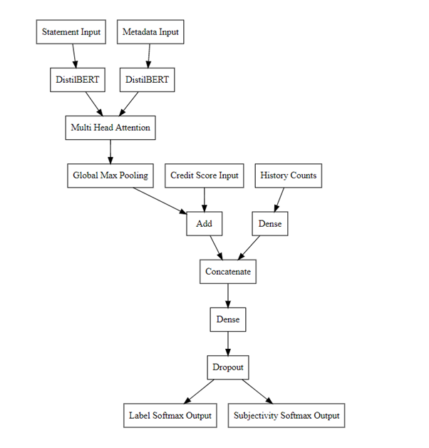

# false-news-detection

False news detection using neural network, based on data from LIAR Dataset, plus enhanced versions. The purpose of the model is to predict the statement based on its degree of truth and subjectivity (both multiclass classification)

More details coming soon.

## Model Design

